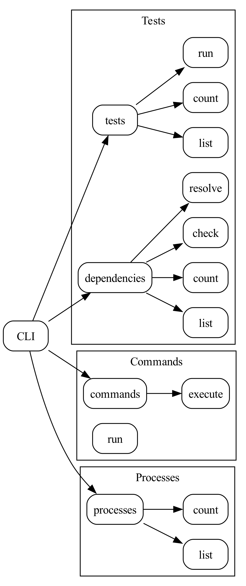

# go-atomic-red-team

This repository provides a client for the [Atomic Red Team framework](https://github.com/redcanaryco/atomic-red-team) written in Go.

> 👷 🚧: this project is experimental, doesn't have a stable API, and is under active development.

## Features

- List, count, and execute tests from the [Atomic Red Team framework](https://github.com/redcanaryco/atomic-red-team);
- List, count, check, and resolve test dependencies;
- Plaintext, YAML, or JSONL output<sub>1</sub>

<sub>1</sub> All output is in JSONL format by default. This makes it easy to parse the output using tools like [jq](https://github.com/jqlang/jq) or [yq](https://github.com/mikefarah/yq).

## Usage

### Local directory

If you'd like to use a local copy of `atomic-red-team`:

1. Download the latest release of the `atomic-red-team` repository
2. Set `ATOMICS_DIR` to the path to the `atomic-red-team/atomics` directory

```shell
git clone https://github.com/redcanaryco/atomic-red-team --depth=1
export ATOMICS_DIR=$(realpath atomic-red-team/atomics)
```

### Tarball file

If you'd like to store tests in a tarball file, follow these steps:

1. Download the latest release of the `atomic-red-team` repository
2. Create an archive of the `atomic-red-team/atomics` directory using `tar`
3. Set `ATOMICS_DIR` to the path to the tarball

```shell
git clone https://github.com/redcanaryco/atomic-red-team --depth=1
tar -czf atomics.tar.gz --directory atomic-red-team/atomics .
export ATOMICS_DIR=$(realpath atomics.tar.gz)
```

> Note: creating an archive involves opening and reading every file in the source directory. This step may fail if endpoint protection controls are enabled. In this case, you should temporarily disable endpoint protection controls while creating the archive.

### Encrypted tarball file

If you'd like to store tests in an encrypted tarball file, follow these steps:

1. Download the latest release of the `atomic-red-team` repository
2. Create an encrypted archive of the `atomic-red-team/atomics` directory using `tar` and `age`
3. Set `ATOMICS_DIR` to the path to the tarball

```shell
tar -czf atomics.tar.gz --directory atomic-red-team/atomics .
age -p atomics.tar.gz > atomics.tar.gz.age
export ATOMICS_DIR=$(realpath atomics.tar.gz.age)
```

> Note: creating an archive involves opening and reading every file in the source directory. This step may fail if endpoint protection controls are enabled. In this case, you should temporarily disable endpoint protection controls while creating the archive.

### Optional

### Environment variables

| Name | Description | Default |
| --- | --- | --- |
| `ATOMICS_DIR` | Path to the `atomic-red-team/atomics` directory | |

### Tests

The command line interface can be used to:

- List, count, and execute tests from the Atomic Red Team framework;
- List, count, check, and resolve test dependencies (e.g. to download any required binaries); and
- List and count running processes.

> The same command line arguments are shared by the `tests` and `test-dependencies` (or, `deps`) commands.



#### List tests

The `tests list` command can be used to list tests:

```shell
go run main.go tests list
```

To list all [tests](https://github.com/redcanaryco/atomic-red-team/blob/master/atomics/T1057/T1057.yaml) for [T1057: Process Discovery](https://attack.mitre.org/techniques/T1057/) that can be run on Windows systems without elevated privileges:

```shell
go run main.go tests list --attack-technique-id="T1057" --platform=windows --elevation-required=false | jq
```

```json
...
{
  "name": "Process Discovery - tasklist",
  "auto_generated_guid": "c5806a4f-62b8-4900-980b-c7ec004e9908",
  "description": "Utilize tasklist to identify processes.\n\nUpon successful execution, cmd.exe will execute tasklist.exe to list processes. Output will be via stdout. \n",
  "supported_platforms": [
    "windows"
  ],
  "executor": {
    "name": "command_prompt",
    "elevation_required": false,
    "command": "tasklist\n"
  },
  "attack_technique_id": "T1057",
  "attack_technique_name": "Process Discovery"
}
...
```

#### Count tests

The `tests count` command can be used to count tests:

```shell
go run main.go tests count --attack-technique-id="T1057" --platform=windows --elevation-required=false
```

```
5
```

#### Run tests

The `tests run` command can be used to run tests:

```shell
go run main.go tests run --help
```

```
Run tests

Usage:
  go-atomic-red-team tests run [flags]

Aliases:
  run, exec, execute, x

Flags:
      --atomics-dir string              Path to atomic-red-team/atomics directory (default "C:\\Users\\tyler\\src\\atomic-red-team")
      --attack-technique-id strings     ATT&CK technique IDs
      --attack-technique-name strings   ATT&CK technique names
      --auto-discover                   Auto-discover atomic-red-team/atomics directory
      --description strings             Test descriptions
      --elevation-required              Elevation required
  -t, --executor-type strings           Executor types
  -h, --help                            help for run
      --id strings                      Test IDs
      --name strings                    Test names
  -p, --plan strings                    Test plans
      --platform strings                Platforms
```

For example, to [tests](https://github.com/redcanaryco/atomic-red-team/blob/master/atomics/T1057/T1057.yaml) for [T1057: Process Discovery](https://attack.mitre.org/techniques/T1057/) that can be run on Windows systems without elevated privileges:

```shell
go run main.go tests run --attack-technique-id="T1057" --platform=windows --elevation-required=false
```

#### List test dependencies

The `deps list` command can be used to list test dependencies:

```shell
go run main.go deps list
```

For example, to list the dependencies of all tests that can be run on Windows systems without elevated privileges:

```shell
go run main.go deps list --platform=windows --elevation-required=false | jq
```

```json
...
{
  "description": "Mimikatz executor must exist on disk and at specified location (#{mimikatz_path})\n",
  "prereq_command": "$mimikatz_path = cmd /c echo #{mimikatz_path}\nif (Test-Path $mimikatz_path) {exit 0} else {exit 1}\n",
  "get_prereq_command": "[Net.ServicePointManager]::SecurityProtocol = [Net.SecurityProtocolType]::Tls12\nIEX (iwr \"https://raw.githubusercontent.com/redcanaryco/invoke-atomicredteam/master/Public/Invoke-FetchFromZip.ps1\" -UseBasicParsing) \n$releases = \"https://api.github.com/repos/gentilkiwi/mimikatz/releases\"\n$zipUrl = (Invoke-WebRequest $releases | ConvertFrom-Json)[0].assets.browser_download_url | where-object { $_.endswith(\".zip\") }\n$mimikatz_exe = cmd /c echo #{mimikatz_path}\n$basePath = Split-Path $mimikatz_exe | Split-Path\nInvoke-FetchFromZip $zipUrl \"x64/mimikatz.exe\" $basePath\n"
}
...
```

#### Count test dependencies

The `deps count` command can be used to count test dependencies:

```shell
go run main.go deps count
```

For example, to count the dependencies of all tests that can be run on Windows systems without elevated privileges:

```shell
go run main.go deps count --platform=windows --elevation-required=false
```

```
298
```

#### Check test dependencies

The `deps check` command can be used to check test dependencies:

```shell
go run main.go deps check
```

For example, to check the dependencies of all tests that can be run on Windows systems without elevated privileges:

```shell
go run main.go deps check --platform=windows --elevation-required=false
```

#### Resolve test dependencies

The `deps resolve` command can be used to resolve test dependencies:

```shell
go run main.go deps resolve
```

For example, to resolve the dependencies of all tests that can be run on Windows systems without elevated privileges:

```shell
go run main.go deps resolve --platform=windows --elevation-required=false
```

### Commands

The `commands run` command can be used to run commands:

```shell
go run main.go commands run whoami | jq
```

```json
{
  "id": "b0bb465e-d372-4b80-b3e4-33235e15620a",
  "time": "2023-11-02T10:24:17.2355431-04:00",
  "command": "cmd /c whoami",
  "process": {
    "id": "7fce7188-c091-5f9b-b4a5-4fd88394cc1f",
    "time": "2023-11-02T10:24:17.2355431-04:00",
    "name": "cmd.exe",
    "pid": 30712,
    "ppid": 27680,
    "cwd": "C:\\Users\\tyler\\go\\src\\github.com\\whitfieldsdad\\go-atomic-red-team\\",
    "file": {
      "id": "9002ec11-74e8-43a1-a0eb-5970b2087e55",
      "time": "2023-11-02T10:24:17.2333898-04:00",
      "path": "C:\\Windows\\System32\\cmd.exe",
      "name": "cmd.exe",
      "size": 323584,
      "hashes": {
        "md5": "5a6be4d2519515241d0c133a26cf62c0",
        "sha1": "13e9bb7e85ff9b08c26a440412e5cd5d296c4d35",
        "sha256": "423e0e810a69aaceba0e5670e58aff898cf0ebffab99ccb46ebb3464c3d2facb",
        "sha512": "8ec72af80539a0cec300e6a4f63e132757892c47f5aae975902239d20bac31e314a8f60514f57c16170944544ab4aaad02098a0980ef9027b1efad6deb31e703",
        "xxh64": "43f480217ef76533",
        "blake3_256": "b5c409ebb25ac26584ca3db247f385b79984c253ff789fb9df9980934627202a"
      },
      "timestamps": {
        "modify_time": "2023-05-12T08:50:45.3868965-04:00",
        "access_time": "2023-11-02T10:24:17.235028-04:00",
        "change_time": null,
        "birth_time": "2023-05-12T08:50:45.3833716-04:00"
      }
    },
    "command_line": "cmd /c whoami",
    "argv": ["cmd", "/c", "whoami"],
    "user": "DESKTOP-LCV0L2T\\tyler",
    "start_time": "2023-11-02T10:24:17.225-04:00",
    "exit_time": "2023-11-02T10:24:17.253238-04:00",
    "exit_code": 0,
    "stdout": "desktop-lcv0l2t\\tyler\r\n"
  }
}
```

### Processes

The `processes list` command can be used to list running processes:

```shell
go run main.go processes list | jq
```

```json
...
{
  "id": "fb4e4590-7f46-56fa-9d37-d2db9b1dce35",
  "time": "2023-11-02T10:22:00.9419743-04:00",
  "name": "Code.exe",
  "pid": 6140,
  "ppid": 13040,
  "cwd": "C:\\Users\\tyler\\AppData\\Local\\Programs\\Microsoft VS Code\\",
  "file": {
    "id": "88fe6155-94da-44eb-b6d4-54206d71c262",
    "time": "2023-11-02T10:21:59.3551177-04:00",
    "path": "C:\\Users\\tyler\\AppData\\Local\\Programs\\Microsoft VS Code\\Code.exe",
    "name": "Code.exe",
    "size": 154620448,
    "hashes": {
      "md5": "c43bbddd2565e09a38c2cd95861c41fb",
      "sha1": "0be5a289e28907a4ebe6177754488f26403418f1",
      "sha256": "cb17b38f5d91721857aa058636fad324a8662901cef6a7917d7db5a20f8e52fa",
      "sha512": "c10c67e88ee05a7652864789e52e1838ccfc95ebe78225e015bfe4782b7ca6e2dabfdcdc7fdfb7a8a99e416f22af412706d63e293c6a665ade91bd0ff02b159f",
      "xxh64": "759252948d93d640",
      "blake3_256": "a64e225a0eb16b776980519882d50c188bc319f92df6bc7f92a38fc9a79e33d7"
    },
    "timestamps": {
      "modify_time": "2023-10-11T00:16:54-04:00",
      "access_time": "2023-11-02T10:22:00.9419743-04:00",
      "change_time": "2023-11-01T14:12:32.7616374-04:00",
      "birth_time": "2023-10-11T17:09:50.678807-04:00"
    }
  },
  "command_line": "\"C:\\Users\\tyler\\AppData\\Local\\Programs\\Microsoft VS Code\\Code.exe\" --type=renderer --user-data-dir=\"C:\\Users\\tyler\\AppData\\Roaming\\Code\" --standard-schemes=vscode-webview,vscode-file --enable-sandbox --secure-schemes=vscode-webview,vscode-file --bypasscsp-schemes --cors-schemes=vscode-webview,vscode-file --fetch-schemes=vscode-webview,vscode-file --service-worker-schemes=vscode-webview --streaming-schemes --app-user-model-id=Microsoft.VisualStudioCode --app-path=\"C:\\Users\\tyler\\AppData\\Local\\Programs\\Microsoft VS Code\\resources\\app\" --enable-sandbox --enable-blink-features=HighlightAPI --lang=en-US --device-scale-factor=1.5 --num-raster-threads=4 --enable-main-frame-before-activation --renderer-client-id=34 --time-ticks-at-unix-epoch=-1698596277353466 --launch-time-ticks=338509080754 --mojo-platform-channel-handle=5812 --field-trial-handle=1624,i,5093568228201681281,8463717612051444964,262144 --disable-features=CalculateNativeWinOcclusion,SpareRendererForSitePerProcess,WinRetrieveSuggestionsOnlyOnDemand --vscode-window-config=vscode:fdefcaa5-e5cc-4ef4-97fb-432db8af49f0 /prefetch:1",
  "argv": [
    "\"C:\\Users\\tyler\\AppData\\Local\\Programs\\Microsoft",
    "VS",
    "Code\\Code.exe\"",
    "--type=renderer",
    "--user-data-dir=\"C:\\Users\\tyler\\AppData\\Roaming\\Code\"",
    "--standard-schemes=vscode-webview,vscode-file",
    "--enable-sandbox",
    "--secure-schemes=vscode-webview,vscode-file",
    "--bypasscsp-schemes",
    "--cors-schemes=vscode-webview,vscode-file",
    "--fetch-schemes=vscode-webview,vscode-file",
    "--service-worker-schemes=vscode-webview",
    "--streaming-schemes",
    "--app-user-model-id=Microsoft.VisualStudioCode",
    "--app-path=\"C:\\Users\\tyler\\AppData\\Local\\Programs\\Microsoft",
    "VS",
    "Code\\resources\\app\"",
    "--enable-sandbox",
    "--enable-blink-features=HighlightAPI",
    "--lang=en-US",
    "--device-scale-factor=1.5",
    "--num-raster-threads=4",
    "--enable-main-frame-before-activation",
    "--renderer-client-id=34",
    "--time-ticks-at-unix-epoch=-1698596277353466",
    "--launch-time-ticks=338509080754",
    "--mojo-platform-channel-handle=5812",
    "--field-trial-handle=1624,i,5093568228201681281,8463717612051444964,262144",
    "--disable-features=CalculateNativeWinOcclusion,SpareRendererForSitePerProcess,WinRetrieveSuggestionsOnlyOnDemand",
    "--vscode-window-config=vscode:fdefcaa5-e5cc-4ef4-97fb-432db8af49f0",
    "/prefetch:1"
  ],
  "user": "DESKTOP-LCV0L2T\\tyler",
  "start_time": "2023-11-02T10:19:44.994-04:00"
}
...
```

The `processes count` command can be used to count running processes:

```shell
go run main.go processes count
```

```
261
```
